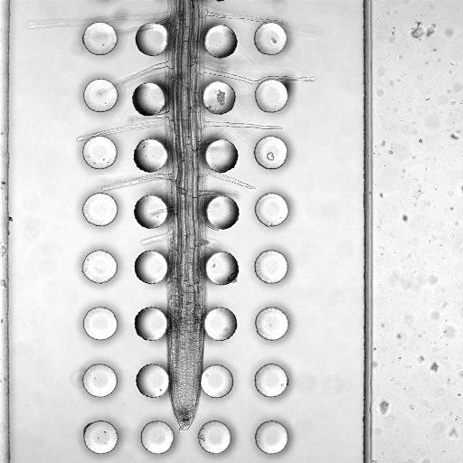
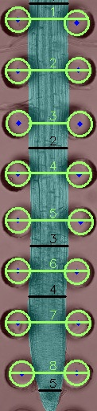

# Pillars_PNuT — Root Turgor Phenotyping via Micropillar Displacement

[](https://colab.research.google.com/github/anaguilarar/Pillars_PNuT/blob/main/root_detection.ipynb)

## Overview

This tool automatically detects and measures the displacement of PDMS micropillars caused by a growing *Arabidopsis thaliana* root. The displacement is a direct proxy for **root turgor pressure** — a key indicator of water status and cell expansion.

The pipeline combines a deep learning segmentation model (VGG16-based CNN) to detect the root with a Hough circle transform to locate the pillars, then computes inter-pillar distances along the root axis.

---

## Biological context

In the micropillar device, pairs of flexible PDMS pillars are arranged in a channel. The root grows longitudinally through the center of the channel and physically pushes the pillars apart. The amount of lateral displacement relative to the resting pillar spacing reflects the **turgor-driven radial expansion force** of the root.

| Raw image | Detected output |
|-----------|-----------------|
|  |  |

Each horizontal line in the output corresponds to one inter-pillar measurement. The distance between the two pillars of a pair (in µm) is recorded in the output CSV, along with a corrected factor relative to the resting pillar spacing (260 µm).

---

## Output

Running the notebook produces:

- **CSV table** — one row per measurement line per image, with columns:
  - `line_index` — position along the root (1 = most apical pair)
  - `distances_pixels` — pillar separation in pixels
  - `distances_microns` — pillar separation in µm (using scale factor)
  - `corrected_factor` — displacement relative to resting spacing: `(distance_µm − 260) / 2`
  - `object` — `pillar` or `root`
  - `image_name` — source image filename

- **Overlay images** — original image with detected pillars (green circles) and measurement lines annotated.

---

## Quick start (Google Colab)

1. Click the **Open in Colab** badge above.
2. Enable GPU: **Runtime → Change runtime type → GPU**.
3. Run **cell 1** (installs `tf-keras`), then restart the runtime when prompted.
4. Upload your `.tif` pillar images using the file upload cell.
5. Run the remaining cells. Results are exported as a CSV and downloadable overlay images.

---

## Local usage

```python
from root_distance.rootdetector_fun import RootandPillars

rootdetector = RootandPillars(
    imagery_path  = "path/to/images/",   # folder containing .tif images
    weigths_path  = "path/to/root_detection.h5",  # model weights
    max_pillars_around_root = 20,         # expected pillars in the channel
    imgsuffix     = ".tif",
    scale_factor  = 0.4023               # µm per pixel for your microscope setup
)

rootdetector.export_detection_as_csv("results.csv")
rootdetector.export_final_images("output_images/")
```

---

## Installation

```bash
pip install tf-keras tensorflow
pip install opencv-python numpy requests pillow matplotlib
```

Python 3.10+ and TensorFlow 2.16+ are supported (tested on Google Colab).

---

## Model weights

Pre-trained weights are downloaded automatically from an S3 bucket when you run the notebook. To use a local H5 file instead, pass its path as `weigths_path`.

To convert legacy TF checkpoint weights to H5 format (one-time operation):

```bash
pip install tf-keras tensorflow -q
python convert_weights_to_h5.py
```

---

## Parameters

| Parameter | Default | Description |
|-----------|---------|-------------|
| `scale_factor` | `0.4023` | µm per pixel — adjust for your microscope magnification |
| `max_pillars_around_root` | `18` | Expected number of pillars visible along the root |
| `imgsuffix` | `.jpg` | Image file extension |
| `minradius` / `maxradius` | `17` / `18` px | Hough circle search range for pillar radius |

---

## Citation

If you use this tool in your research, please cite this repository:

```
Aguilar, A. (2024). Pillars_PNuT: Deep learning-based root turgor phenotyping
via micropillar displacement. https://github.com/anaguilarar/Pillars_PNuT
```
